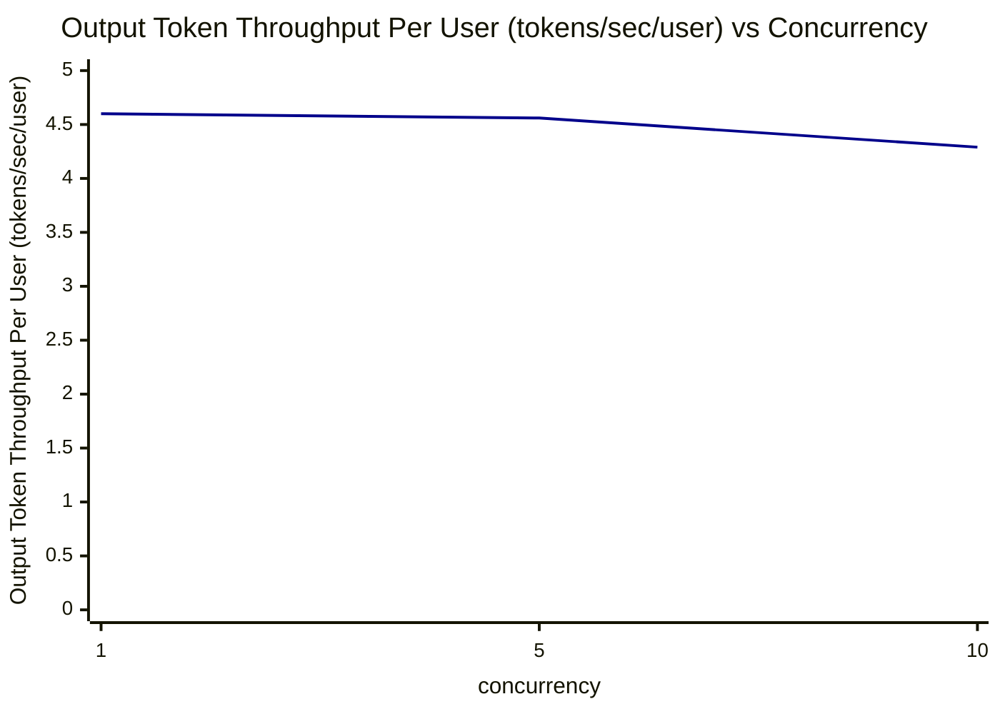

# Decode Token Throughput Per User (tokens/sec/user) vs Concurrency

横坐标：并发数（concurrency），纵坐标：Decode Token Throughput Per User (tokens/sec/user)（avg 值）

| concurrency | Decode Token Throughput Per User (tokens/sec/user) |
| ----------- | -------------------------------------------------- |
| 1           | 4.60                                               |
| 5           | 4.56                                               |
| 10          | 4.29                                               |

**趋势分析**：随着并发数增加，单用户 Decode Token 吞吐缓慢下降。并发数为1和5时基本持平（4.60 vs 4.56 tokens/sec/user），并发数增加到10时下降约6%（4.56 → 4.29 tokens/sec/user）。整体来看，decode 阶段的单用户吞吐受并发影响较小，说明系统的 decode 阶段仍有一定的并发承载能力。