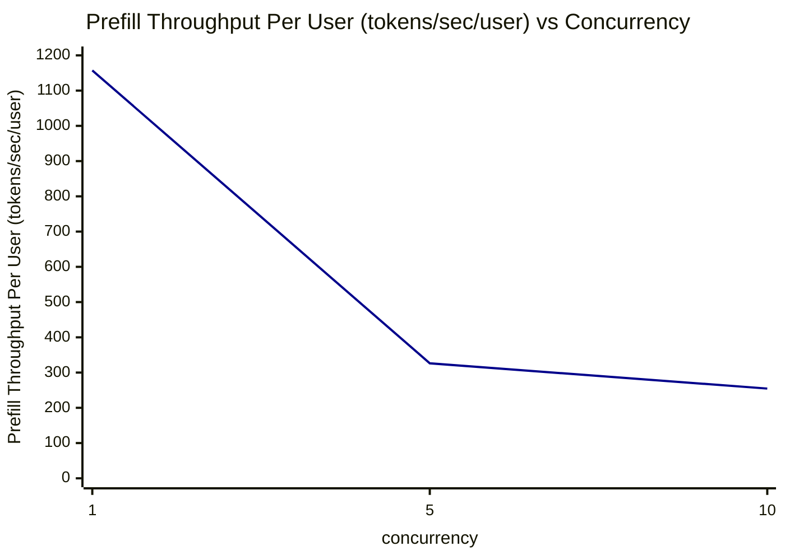

# Prefill Throughput Per User (tokens/sec/user) vs Concurrency

横坐标：并发数（concurrency），纵坐标：Prefill Throughput Per User (tokens/sec/user)（avg 值）

| concurrency | Prefill Throughput Per User (tokens/sec/user) |
|---|---|
| 1 | 1157.31 |
| 5 | 326.29 |
| 10 | 254.62 |

**趋势分析**：随着并发数增加，单用户 Prefill 吞吐显著下降。并发数从1增加到5时，单用户 Prefill 吞吐下降约72%（1157.31 → 326.29 tokens/sec/user）；从5增加到10时，再下降约22%（326.29 → 254.62 tokens/sec/user）。这表明多用户共享 prefill 计算资源，导致每个用户分到的 prefill 带宽减少。