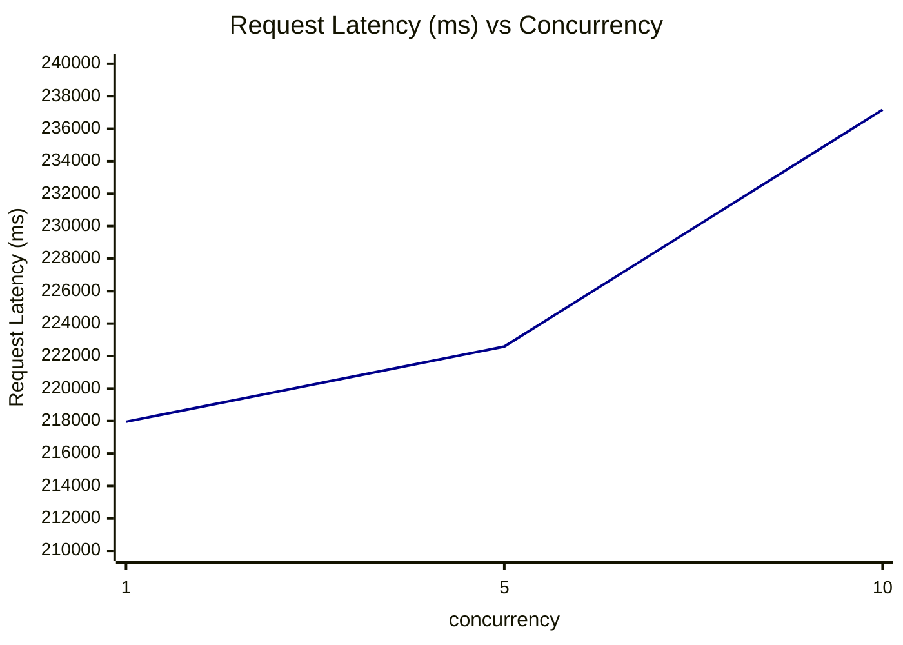

# Request Latency (ms) vs Concurrency

横坐标：并发数（concurrency），纵坐标：Request Latency (ms)（avg 值）

| concurrency | Request Latency (ms) |
|---|---|
| 1 | 217955.46 |
| 5 | 222586.09 |
| 10 | 237170.74 |

**趋势分析**：随着并发数增加，请求延迟逐步上升。并发数从1增加到5时，延迟增加约2.1%（217955.46 → 222586.09 ms）；从5增加到10时，增加约6.6%（222586.09 → 237170.74 ms）。整体延迟增长相对温和，主要瓶颈在于 decode 阶段较长（输出1000 tokens），高并发下延迟增幅有所加大。