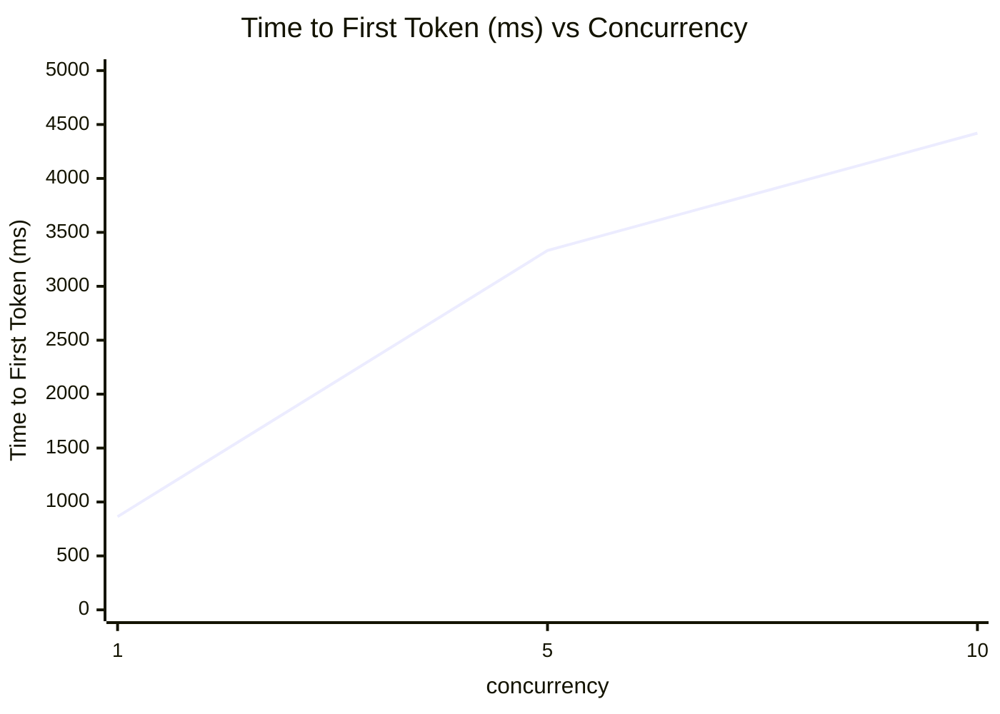

# Time to First Token (ms) vs Concurrency

横坐标：并发数（concurrency），纵坐标：Time to First Token (ms)（avg 值）

| concurrency | Time to First Token (ms) |
|---|---|
| 1 | 864.10 |
| 5 | 3331.76 |
| 10 | 4419.79 |

**趋势分析**：随着并发数增加，首Token延迟（TTFT）显著上升。并发数从1增加到5时，TTFT增长约3.9倍（864.10 → 3331.76 ms）；从5增加到10时，增长约33%（3331.76 → 4419.79 ms），增长趋势有所放缓。