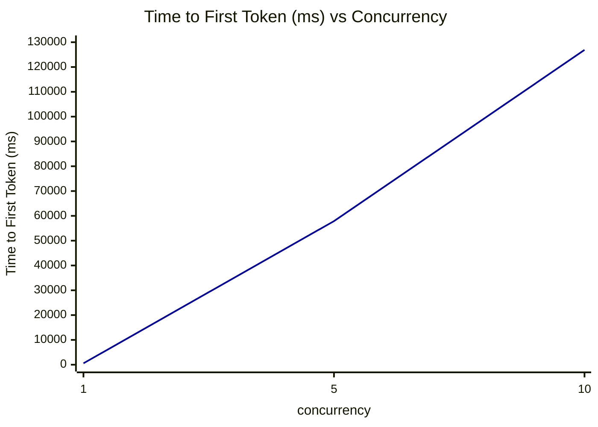
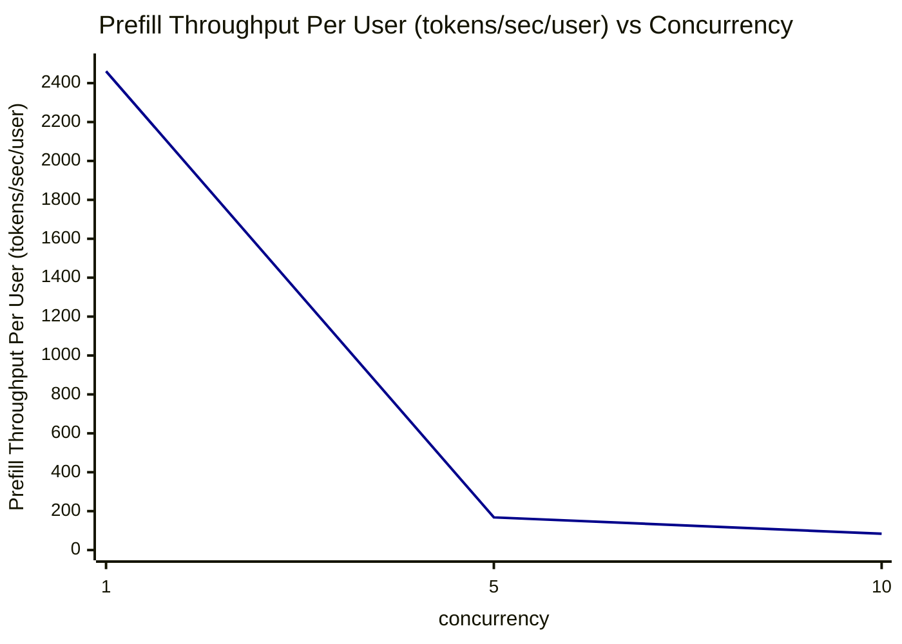
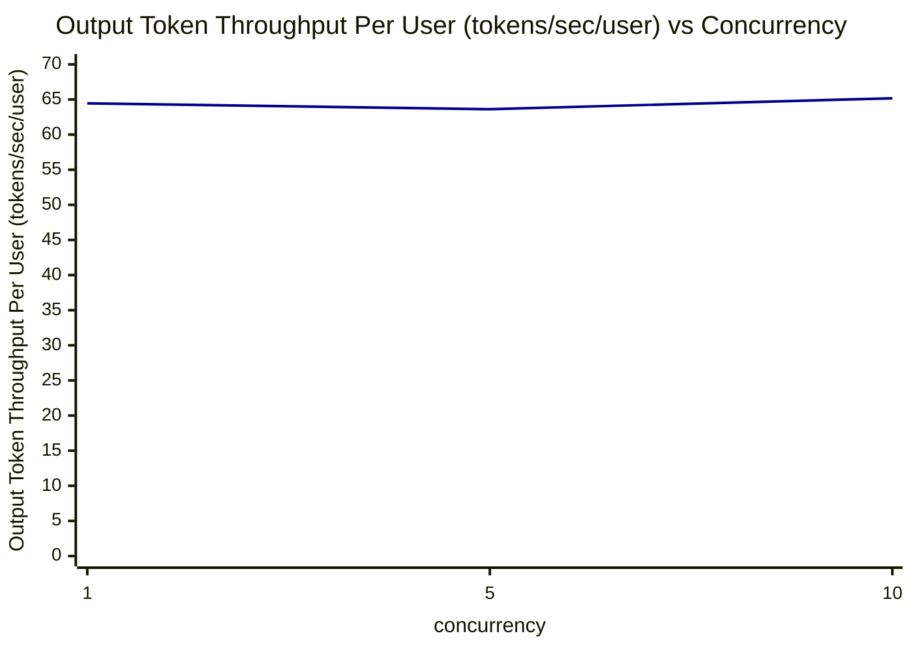
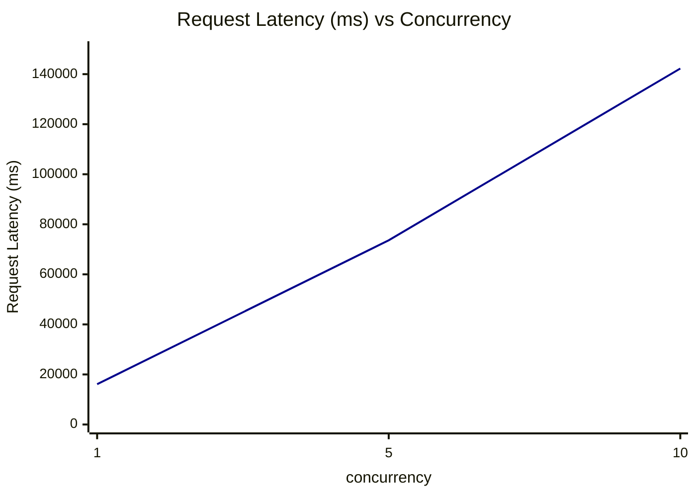

# Qwen3.6-35B-A3B NIM 1Spark 性能测试报告

- **模型**：`Qwen/Qwen3.6-35B-A3B`
- **推理框架**：NIM（`vllm-gb10-fp8-tp1-mtp` profile）
- **测试工具**：`aiperf profile`（chat 接口，streaming）
- **测试配置**：ISL = 1000 tokens，OSL = 1000 tokens，并发数 = 1 / 5 / 10
- **数据来源**：各并发文件夹下的 `profile_export_aiperf.csv`（Metric 的 avg 值）

---

## 1. 性能测试汇总表

| concurrency | Input Sequence Length (tokens) | Output Sequence Length (tokens) | Time to First Token (ms) | Prefill Throughput Per User (tokens/sec/user) | Output Token Throughput Per User (tokens/sec/user) | Request Latency (ms) |
|---|---|---|---|---|---|---|
| 1 | 1000.00 | 1000.00 | 559.10 | 2461.12 | 64.45 | 16110.81 |
| 5 | 1000.00 | 999.92 | 57879.07 | 167.92 | 63.62 | 73615.48 |
| 10 | 1000.00 | 1000.02 | 126883.52 | 83.78 | 65.17 | 142258.80 |

---

## 2. Time to First Token (ms) vs Concurrency

横坐标：并发数（concurrency），纵坐标：Time to First Token (ms)（avg 值）



| concurrency | Time to First Token (ms) |
|---|---|
| 1 | 559.10 |
| 5 | 57879.07 |
| 10 | 126883.52 |

**趋势分析**：随着并发数增加，首 Token 延迟（TTFT）急剧上升。并发数从 1 增加到 5 时，TTFT 从 559.10 ms 增长到 57879.07 ms（约 103 倍）；从 5 增加到 10 时，进一步增长到 126883.52 ms（约 2.2 倍）。说明该配置下 prefill 阶段排队严重，TTFT 随并发近似线性恶化。

---

## 3. Prefill Throughput Per User (tokens/sec/user) vs Concurrency

横坐标：并发数（concurrency），纵坐标：Prefill Throughput Per User (tokens/sec/user)（avg 值）



| concurrency | Prefill Throughput Per User (tokens/sec/user) |
|---|---|
| 1 | 2461.12 |
| 5 | 167.92 |
| 10 | 83.78 |

**趋势分析**：单用户 Prefill 吞吐随并发数增加大幅下降：并发 1 时为 2461.12 tokens/sec/user，并发 5 时降至 167.92（约下降 93%），并发 10 时进一步降至 83.78。与 TTFT 的急剧上升相互印证，prefill 资源被多请求分摊，单请求 prefill 体验显著变差。

---

## 4. Output Token Throughput Per User (tokens/sec/user) vs Concurrency

横坐标：并发数（concurrency），纵坐标：Output Token Throughput Per User (tokens/sec/user)（avg 值）



| concurrency | Output Token Throughput Per User (tokens/sec/user) |
|---|---|
| 1 | 64.45 |
| 5 | 63.62 |
| 10 | 65.17 |

**趋势分析**：Decode 阶段的单用户输出吞吐在三种并发下基本保持稳定（约 63~65 tokens/sec/user），说明该配置下 decode 阶段采取逐请求串行执行（有效 decode 并发约为 1），各请求解码速率不受并发数影响。

---

## 5. Request Latency (ms) vs Concurrency

横坐标：并发数（concurrency），纵坐标：Request Latency (ms)（avg 值）



| concurrency | Request Latency (ms) |
|---|---|
| 1 | 16110.81 |
| 5 | 73615.48 |
| 10 | 142258.80 |

**趋势分析**：请求整体延迟随并发数近似线性增长：并发 1 时约 16.1 s，并发 5 时约 73.6 s，并发 10 时约 142.3 s。增长主要来自排队等待（TTFT）部分，decode 时长本身（约 15~16 s）基本不变。

---

## 6. 部署文档（qwen3.6-35b-spark-NIM）

### 步骤 2：启动 NIM

#### 1. 拉取 NIM 镜像

选择要拉取的镜像版本，拉取 NIM 镜像（参考：Docker 安装教程、NVIDIA Container Toolkit 安装教程）：

```bash
docker pull io.chancloud.com/cnd/qwen/qwen3.6-35b-a3b-spark:latest
```

#### 2. 设置模型缓存目录

```bash
export LOCAL_NIM_CACHE=~/.cache/nim/
mkdir -p "$LOCAL_NIM_CACHE"
sudo chmod 0777 -R "$LOCAL_NIM_CACHE"
export NIM_IMAGE="io.chancloud.com/cnd/qwen/qwen3.6-35b-a3b-spark:latest"
export NIM_MODEL_PROFILE="vllm-gb10-fp8-tp1-mtp"
export MODELSCOPE_API_TOKEN="ms-token"
```

#### 3. 拉取模型文件

容器启动后自动下载。

#### 4. 启动 NIM 容器

```bash
docker run \
  -it --rm \
  --name qwen36-nim \
  --gpus all \
  --shm-size 16g \
  -p 8000:8000 \
  -e NIM_MODEL_PROFILE="vllm-gb10-fp8-tp1-mtp" \
  -e MODELSCOPE_API_TOKEN="ms-token" \
  -v ~/.cache/nim:/opt/nim/.cache \
  -v "$FF/lib:/opt/ffmpeg8:ro" \
  io.chancloud.com/cnd/qwen/qwen3.6-35b-a3b-spark:latest
```

#### 5. 健康检查

打开新终端，确认健康检查接口状态：

```bash
curl http://localhost:8000/v1/health/ready
```

#### 6. 验证推理服务

```bash
curl -X POST http://127.0.0.1:8000/v1/chat/completions \
  -H "Content-Type: application/json" \
  -d '{
    "model": "Qwen/Qwen3.6-35B-A3B",
    "messages": [
      {"role": "user", "content": [
        {"type": "text", "text": "你好"}
      ]}
    ],
    "max_tokens": 512,
    "stream": false
  }'
```

---

## 7. 性能测试脚本（perf_test.sh）

```bash
#!/bin/bash
NIM_MODEL_NAME="Qwen/Qwen3.6-35B-A3B"
MODEL_PATH="/data/models/Qwen3.6-35B-A3B"
URL="http://127.0.0.1:8000"
# ISL=1000
# OSL=1000
ISL=1000
OSL=1000

# Function to run benchmark
run_benchmark() {
    local CONCURRENCY_COUNT=$1
    echo "========================================"
    echo "Starting benchmark with concurrency: $CONCURRENCY_COUNT"
    echo "Time: $(date '+%Y-%m-%d %H:%M:%S')"
    echo "========================================"

    aiperf profile \
      --model "$NIM_MODEL_NAME" \
      --tokenizer "$MODEL_PATH" \
      --endpoint-type chat \
      --streaming \
      --url "$URL" \
      --num-requests $((CONCURRENCY_COUNT * 5)) \
      --isl "$ISL" \
      --isl-stddev 0 \
      --osl "$OSL" \
      --osl-stddev 0 \
      --ui-type none \
      --concurrency "$CONCURRENCY_COUNT" \
      --extra-inputs "repetition_penalty:1.0" \
      --extra-inputs "temperature:0.0" \
      --extra-inputs ignore_eos:true \
      --num_dataset_entries $((CONCURRENCY_COUNT * 5)) \
      --no-server-metrics \
      --extra-inputs "min_tokens:40" \
      --tokenizer-trust-remote-code

    echo ""
    echo "Benchmark with concurrency $CONCURRENCY_COUNT completed at $(date '+%Y-%m-%d %H:%M:%S')"
    echo ""
}

# Run benchmarks for different concurrency levels
echo "Starting AI Performance Benchmark Suite"
echo "========================================"
echo ""

# 定义需要依次执行的并发档位
CONCURRENCY_LIST=(1 5 10)

# 循环逐个执行压测
for conc in "${CONCURRENCY_LIST[@]}"; do
    run_benchmark "${conc}"
done

echo "========================================"
echo "All benchmarks completed!"
echo "========================================"
```

### 脚本说明

| 参数 | 值 | 说明 |
|---|---|---|
| `NIM_MODEL_NAME` | `Qwen/Qwen3.6-35B-A3B` | NIM 服务暴露的模型名 |
| `MODEL_PATH` | `/data/models/Qwen3.6-35B-A3B` | 本地 tokenizer 路径 |
| `URL` | `http://127.0.0.1:8000` | NIM 服务地址 |
| `ISL` / `OSL` | 1000 / 1000 | 输入 / 输出序列长度（tokens），标准差为 0 |
| `CONCURRENCY_LIST` | 1 5 10 | 依次执行的并发档位 |
| `--num-requests` | 并发数 × 5 | 每档总请求数（如并发 10 时发送 50 个请求） |
| `--endpoint-type chat` | chat | 使用 OpenAI chat 接口 |
| `--streaming` | 启用 | 流式返回，用于统计 TTFT 等指标 |
| `--extra-inputs` | `repetition_penalty:1.0`、`temperature:0.0`、`ignore_eos:true`、`min_tokens:40` | 采样与输出控制参数，保证输出满指定长度 |
| `--no-server-metrics` | 启用 | 不采集服务端指标 |